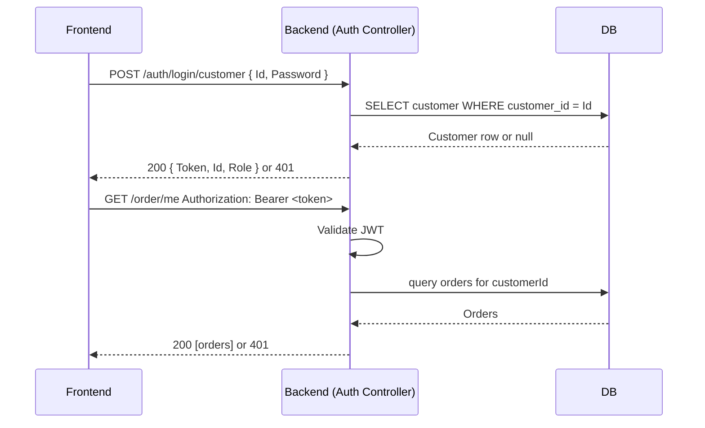
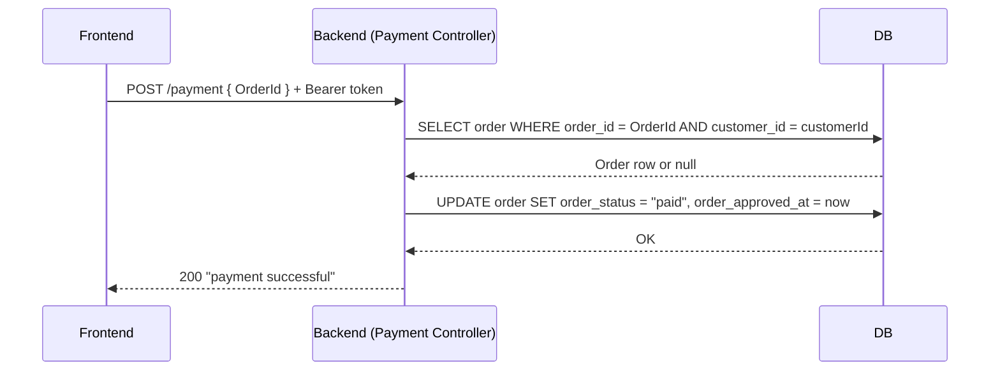

## For development of backend
To run backend web application without using docker containers, then run the following from the ./backend folder:

```
dotnet watch run
```

Notice that when run outside docker containers, it will run on the ports specified in `./backend/Properties/launchSettings.json`

# Software architecture
The backend is built using ASP.NET Core Web API. It follows a layered architecture with the following layers:
- **Models**: Represent the data structures used in the application. CRUD operations are performed on these models.
- **Controllers**: Handle HTTP requests from the client. They are responsible for receiving input from the client and returning appropriate responses.
- **Views**: Responsible for rendering the user interface.

# API Documentation
The backend API is documented using Swagger. When the application is running, you can access the Swagger UI at `http://localhost:8080/swagger` to explore the available API endpoints and their documentation

But here are still some more examples:

## Auth

Every protected route requires a **JWT Bearer token** (`Authorization: Bearer <token>`). Tokens encode `user_id` and `role` (`customer` or `seller`) and expire after 60 minutes.



### JWT Claims

| Claim | Value |
|---|---|
| `sub` / `user_id` | customer or seller ID |
| `role` | `customer` \| `seller` |
| `exp` | now + 60 min |
| `iss` | `cloud-native-shop` |
| `aud` | `cloud-native-shop-clients` |

### Endpoint Access

```
POST /auth/login/customer   public
POST /auth/login/seller     public
GET  /customer/me           customer only
GET  /seller/me             seller only
POST /order                 customer only
GET  /order/me              customer only
GET  /order/seller          seller only
GET  /product               public
GET  /product/{id}          public
GET  /category              public
POST /payment               customer only
```

---

## Auth Examples

### POST /auth/login/customer

```http
POST /auth/login/customer
Content-Type: application/json

{ "Id": "06b8f9a417f9d72661e5b3c8a1234567", "Password": "password" }
```

```json
// 200 OK
{ "Token": "eyJhbGci...", "Id": "06b8f9a417f9d72661e5b3c8a1234567", "Role": "customer" }

// 401 — wrong ID or password (empty body)
// 400 — missing fields (empty body)
```

### POST /auth/login/seller

```http
POST /auth/login/seller
Content-Type: application/json

{ "Id": "seller_abc123def456", "Password": "password" }
```

```json
// 200 OK
{ "Token": "eyJhbGci...", "Id": "seller_abc123def456", "Role": "seller" }
```

### GET /customer/me

```json
// 200 OK
{
  "CustomerId": "06b8f9a417f9d72661e5b3c8a1234567",
  "CustomerUniqueId": "f9b7e2d1c3a5",
  "CustomerZipCodePrefix": "14409",
  "CustomerCity": "franca",
  "CustomerState": "SP"
}
```

### GET /seller/me

```json
// 200 OK
{
  "SellerId": "seller_abc123def456",
  "SellerZipCodePrefix": "01310",
  "SellerCity": "sao paulo",
  "SellerState": "SP"
}
```

---

## Order Flow

**POST /order** — validates the JWT, checks each product exists in the DB, then inserts an `orders` row and one `order_items` row per item. Estimated delivery is set to now + 7 days.

**GET /order/me** — returns all orders for the authenticated customer, including nested items.

**GET /order/seller** — returns all orders that contain at least one item where `SellerId` matches the authenticated seller.

---

## Order Examples

### POST /order

```http
POST /order
Authorization: Bearer eyJhbGci...
Content-Type: application/json

{
  "Items": [
    { "ProductId": "afe0d4e3-...", "SellerId": "seller_abc123def456", "Quantity": 2, "Price": 49.90 },
    { "ProductId": "b7c1e5f2-...", "SellerId": "seller_abc123def456", "Quantity": 1, "Price": 19.99 }
  ]
}
```

```json
// 201 Created
{
  "OrderId": "a1b2c3d4-...",
  "CustomerId": "06b8f9a417f9d72661e5b3c8a1234567",
  "OrderStatus": "created",
  "OrderPurchaseTimestamp": "2026-04-23T10:30:00Z",
  "OrderEstimatedDeliveryDate": "2026-04-30T10:30:00Z",
  "OrderItems": [
    { "OrderItemId": 1, "ProductId": "afe0d4e3-...", "SellerId": "seller_abc123def456", "OrderItemQuantity": 2, "Price": 49.90, "FreightValue": 0 },
    { "OrderItemId": 2, "ProductId": "b7c1e5f2-...", "SellerId": "seller_abc123def456", "OrderItemQuantity": 1, "Price": 19.99, "FreightValue": 0 }
  ]
}

// 400 — "Product afe0d4e3-... not found"
// 401 — invalid/missing token (empty body)
```

### GET /order/me  and  GET /order/seller

Both return the same order structure as above (array). `/order/seller` filters to orders containing the seller's items.

---

## Payment Flow

**POST /payment** — mock payment endpoint. Looks up the order by `OrderId`, verifies it belongs to the authenticated customer and is in `"created"` status, then sets `OrderStatus = "paid"` and `OrderApprovedAt = now`.



### POST /payment

```http
POST /payment
Authorization: Bearer eyJhbGci...
Content-Type: application/json

{ "OrderId": "a1b2c3d4-..." }
```

```json
// 200 OK
"payment successful"

// 400 — "Order cannot be paid in its current status." (e.g. already paid)
// 404 — "Order not found." (wrong ID or belongs to another customer)
// 401 — invalid/missing token (empty body)
```

### Order Status Lifecycle

| Status | Set by |
|---|---|
| `"created"` | `POST /order` |
| `"paid"` | `POST /payment` |

---

## Products & Categories

### GET /product

Returns top 20 products. Images are fetched live from the Pexels API.

```json
[{ "Id": "afe0d4e3-...", "Name": "garden tools", "Description": "...", "Price": 49.90, "ImageUrl": "https://..." }]
```

### GET /product/{id}

```json
// 200 OK — same shape as above (single object)
// 404 — not found (empty body)
```

### GET /category

```json
[
  { "ProductCategoryName": "ferramentas_jardim", "ProductCategoryNameEnglish": "garden tools" },
  { "ProductCategoryName": "eletronicos",        "ProductCategoryNameEnglish": "electronics" }
]
```
