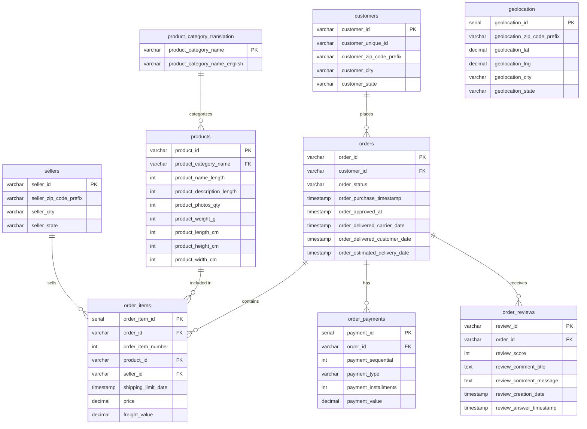

# E-commerce Database ER Diagram

## Crow's Foot Notation Guide

- `||` = **Exactly one** (must exist)
- `|o` = **Zero or one** (optional, max one)
- `}|` = **One or many** (at least one)
- `}o` = **Zero or many** (optional, unlimited)

**Example:** `customers ||--o{ orders` means "One customer can have zero or many orders, and each order belongs to exactly one customer"

## Database Schema

## Relationships

- **customers** → **orders**: One customer can place zero or many orders
- **orders** → **order_items**: Each order contains zero or many items
- **orders** → **order_payments**: Each order has zero or many payment records
- **orders** → **order_reviews**: Each order receives zero or many reviews
- **products** → **order_items**: Each product appears in zero or many order items
- **sellers** → **order_items**: Each seller fulfills zero or many order items
- **product_category_translation** → **products**: Each category contains zero or many products
- **geolocation**: Used for geographic lookups via zip code prefix (no direct foreign key)
