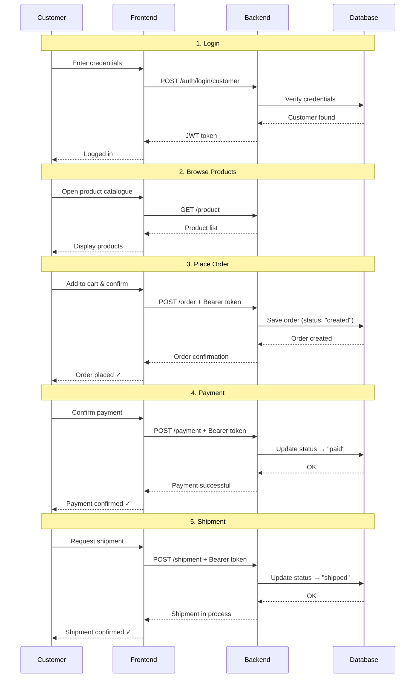
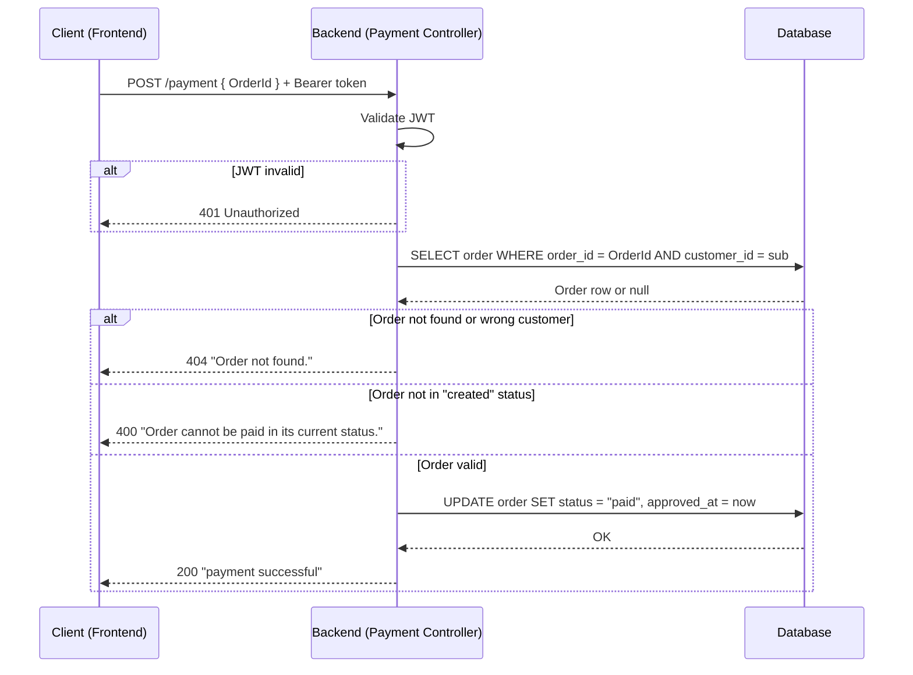
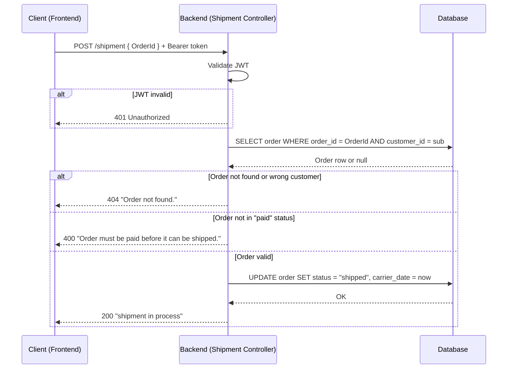

# Sequence Diagrams

---

## 1. End-to-End Customer Order Flow

This diagram gives a high-level overview of the complete customer journey on the platform. It covers five phases in sequence: login, product browsing, order placement, payment, and shipment. Each phase must succeed before the next can begin. The detailed internal logic of authentication, payment, and shipment is covered in the dedicated diagrams below.



---

## 2. Authentication

Authentication is handled via a simple credential check followed by JWT issuance. The customer (or seller) sends their ID and password to `POST /auth/login/customer` (or `/seller`). The backend looks up the matching record in the database and, if the credentials are valid, responds with a signed JWT token.

The token encodes the user's ID and role (`customer` or `seller`) and expires after **60 minutes**. It is stored on the frontend and appended as an `Authorization: Bearer <token>` header to every subsequent request. The backend validates this token on every protected route — checking signature, expiry, and role — before processing the request. Any missing, forged, or expired token results in a `401 Unauthorized` response, with no further processing.

The diagram below shows both the login step and an example of a protected route call (`GET /order/me`) to illustrate how the issued token is used in practice.

```mermaid
sequenceDiagram
    participant C as Client (Frontend)
    participant API as Backend (Auth Controller)
    participant DB as Database

    C->>API: POST /auth/login/customer { Id, Password }
    API->>DB: SELECT customer WHERE customer_id = Id
    DB-->>API: Customer row or null

    alt Valid credentials
        API-->>C: 200 { Token (JWT), Id, Role: "customer" }
        Note over C: Token stored; attached as Bearer on future requests
    else Invalid credentials
        API-->>C: 401 Unauthorized
    end

    %% Using the token on a protected route
    C->>API: GET /order/me  [Authorization: Bearer <token>]
    API->>API: Validate JWT (signature, expiry, role)
    alt Token valid
        API->>DB: SELECT orders WHERE customer_id = sub
        DB-->>API: Order rows
        API-->>C: 200 [orders]
    else Token invalid / expired
        API-->>C: 401 Unauthorized
    end
```

---

## 3. Payment

The payment flow transitions an order from `created` to `paid`. It is a mock implementation — no external payment provider is involved — but the backend enforces a strict set of guards before accepting the request.

When the frontend sends `POST /payment`, the backend first validates the JWT to confirm the caller's identity. It then queries the database for the order, verifying both that the order exists **and** that it belongs to the authenticated customer. This prevents one customer from paying on behalf of another. If the order is found but is not in `created` status (e.g. it was already paid), the request is rejected with `400 Bad Request`. Only when all checks pass does the backend update the order record — setting the status to `paid` and recording the approval timestamp.



---

## 4. Shipment

The shipment flow is the final step in the order lifecycle, advancing an order from `paid` to `shipped`. Like payment, it is a mock implementation that enforces guards to ensure the order lifecycle is never skipped or reversed.

The backend validates the JWT, then looks up the order in the database — again verifying ownership by the authenticated customer. The critical check here is that the order must be in `paid` status: an order that has not been paid cannot be shipped, and an order that is already shipped cannot be re-processed. If all guards pass, the backend sets the status to `shipped` and records the carrier handover timestamp (`OrderDeliveredCarrierDate = now`). After this point the order has reached its terminal state and no further status transitions are possible.


